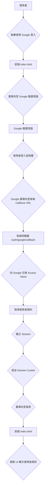
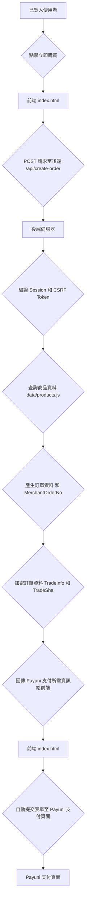
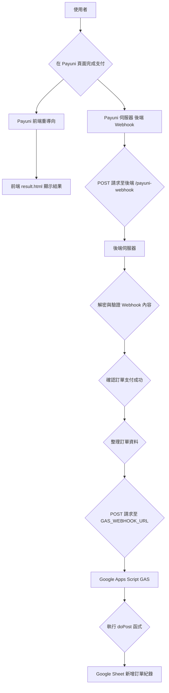

# 系統架構

理解各個環節如何互動，充分理解後，你能更加理解關於保護機敏資訊與有效性的互動流程。
同時也是後續進行客製化與功能擴充的關鍵。

---

## 📚 閱讀順序建議

1. **先讀** `00_DESIGN_PHILOSOPHY.md`
   → 理解「為什麼」設計成這樣

2. **再讀本文**
   → 理解「具體怎麼做」

3. **接著根據需求深入**
   - 關注安全細節？ → `02_SECURITY_DEEP_DIVE.md`
   - 想自己實作？ → `03_CUSTOMIZATION_GUIDE.md`
   - 準備部署上線？ → `04_DEPLOYMENT.md`

---

## 1. 核心元件拆解

我們的系統主要由以下幾個核心元件組成：

| 元件                | 技術/服務                            | 扮演的角色                                                                                             |
| :------------------ | :----------------------------------- | :----------------------------------------------------------------------------------------------------- |
| **前端 (Frontend)** | `HTML`, `CSS`, `JavaScript`          | **使用者介面**：呈現商品、處理 Google 登入、觸發購買流程、跳轉 Payuni UPP 支付頁面、顯示支付結果。     |
| **後端 (Backend)**  | `Node.js` / `Express.js`             | **伺服器中心**：串連所有服務的核心，負責處理業務邏輯、驗證與安全性。                                   |
| **支付閘道**        | `Payuni API`                         | **金流方**：接收訂單資訊並建立付款頁面，於金流方平台進行實際的支付流程，我們的系統不經手任何支付過程。 |
| **身份驗證**        | `Google OAuth 2.0`                   | **使用者身份**：提供一個安全、可信賴的第三方登入機制，避免惡意註冊、以及增加資料管理成本。             |
| **人機驗證**        | `Cloudflare Turnstile`               | **機器人防護**：以對使用者友善的方式 (非 Recaptcha)，過濾惡意機器人流量。                              |
| **資料庫**          | `Google Apps Script / n8n` + `Sheet` | **訂單資料儲存**：一個無伺服器、高可用性且免費的訂單儲存解決方案。                                     |

---

## 2. 核心流程詳解

理解以下三個核心流程，您就能掌握整個系統的運作精髓。

### 流程一：使用者登入 (Google OAuth 2.0)

> **情境提要：**
> 想像顧客來到店裡，我們需要知道他是誰 (至少要是人)，於是他在消費之前須要登入 Google 驗證身份。
>
> 驗證完畢後，Google 會給顧客一串**『驗證碼』**（Authorization Code），並讓他帶回來交給我們的後台。
>
> 我們伺服器收到這串驗證碼後，會**再次**跟 Google 確認是否有效，確認無誤後，**才會發給顧客一張允許消費的『通行證』（Session Cookie）**。
> 此時你可以將這位顧客加入會員資料。



1.  **觸發**：使用者在 `index.html` 上點擊「使用 Google 登入」。
2.  **重導向至 Google**：瀏覽器被導向至 Google 的身份驗證頁面。
3.  **使用者授權**：使用者在 Google 頁面登入並同意授權。
4.  **回呼 (Callback)**：Google 將使用者導回至我們後端設定的 `GOOGLE_REDIRECT_URI` (`/auth/google/callback`)，並附帶一個授權碼 (Authorization Code)。
5.  **後端驗證**：我們的 Express 伺服器收到授權碼後，在後端向 Google 交換存取權杖 (Access Token)，並用權杖取得使用者資料（名稱、頭像等）。
6.  **建立 Session**：伺服器為該使用者建立一個 Session，並將使用者資訊存入其中，同時向瀏覽器發送一個加密的 Session Cookie。
7.  **重導向至首頁**：伺服器將使用者導回網站首頁。前端偵測到登入狀態，更新 UI，顯示使用者名稱與頭像。

### 流程二：建立訂單與前往支付

> **情境提要：**
> 顧客決定購買後，我們會先將這次的交易輸入資料庫，因為我們不確定付款過程會不會出現錯誤、顧客可能拿出錢包時發現身上錢不夠，以及我們也需要讓付款結果與我們的資料庫是可以對應的(可追溯)。
> 在這個過程中，我們會確認顧客身份等驗證都沒問題後，在資料庫建立一筆正式訂單，並將所有內容加密交予顧客，並引導他去金流平台頁面進行付款。



1.  **觸發**：已登入的使用者在 `index.html` 上點擊「立即購買」。
2.  **前端請求**：前端 JavaScript 向後端的 `/api/create-order` 端點發起一個 `POST` 請求，請求中包含商品 ID 與 CSRF Token。
3.  **後端處理**：
    a. 伺服器驗證使用者的 Session 與 CSRF Token，確保請求合法。
    b. 根據商品 ID 從 `data/products.js` (或者你可以從資料庫獲取) 查找價格與商品名稱。
    c. 產生一筆新的訂單資料，包含唯一的訂單號 (`MerchantOrderNo`)。
    d. 將訂單資料與 Payuni 的 `HashKey` 及 `HashIV` 進行加密，產生 `TradeInfo` (加密後的訂單) 與 `TradeSha` (簽名)。
4.  **回傳給前端**：後端將 `TradeInfo`、`TradeSha` 及 Payuni 的 API 端點等必要資訊回傳給前端。
5.  **跳轉至 Payuni**：前端收到後端的回應後，會動態建立一個表單，並自動將這些資訊 `POST` 到 Payuni 的支付頁面。此時，使用者的瀏覽器畫面會從您的網站跳轉到 Payuni 的網站。

### 流程三：支付確認與訂單紀錄 (Webhook)

> **情境提要：**
> 在顧客付款成功後，金流平台會將結果通知我們和顧客：
>
> 1.  **Return URL**：付款成功後，顧客會被告知已經付款了，形式可以由我們決定，可能是一張紙、可能只是一個訊息...etc。
>
>     - **不可盡信**：它只是一個快速的操作回饋、非正式的通知。
>
> 2.  **Notify URL**：幾乎在同一時間，金流平台會透過這個管道，將交易內容加密、送到我們處理專門 Notify 的地方。
>     - **唯一可信**：我們收到後，會解密內容並驗證是否有效。只有這則通知內容確認無誤，我們才會同步紀錄到會員的購買資料。

這是整個流程中相當關鍵的一步，它確保了交易的最終一致性。



1.  **使用者支付**：使用者在 Payuni 頁面輸入信用卡資訊並完成支付。
2.  **兵分兩路**：
    - **路徑 A (前端)**：Payuni 將使用者的瀏覽器導回到您指定的 `PAYUNI_RETURN_URL` (`result.html`)。**這僅用於提供即時的使用者體驗，不應作為訂單成功的依據。**
    - **路徑 B (後端 - 真實的交易通知)**：在背景，Payuni 的伺服器會向您在 `.env` 中設定的 `NOTIFY_URL` (`/payuni-webhook`) 發送一個 `POST` 請求。這就是「Webhook」，是唯一可信的交易結果通知。
3.  **後端接收 Webhook**：您的 Express 伺服器接收到這個 Webhook 請求。
4.  **解密與驗證**：伺服器使用 `utils/crypto.js` 中的 AES-256-GCM 解密函式，對 Webhook 內容進行解密與驗證。這一步確保了通知確實來自 Payuni 且內容未被篡改。
5.  **確認訂單成功**：驗證成功後，後端即可 100% 確認這筆訂單已支付成功。
6.  **觸發 GAS**：後端將訂單號、金額、商品名稱、使用者等關鍵資訊，整理成一個乾淨的 JSON 物件。
7.  **寫入 Google Sheet**：後端向您在 `.env` 中設定的 `GAS_WEBHOOK_URL` 發起一個 `POST` 請求，將上述 JSON 物件傳送過去。
8.  **GAS 執行**：部署在雲端的 Google Apps Script 被觸發，執行 `doPost` 函式，將接收到的 JSON 資料新增一行到您指定的 Google Sheet 中，完成訂單的最終紀錄。

---

## 3. 結論

你可以注意到，我們的所有流程都相當強調「驗證有效性」這點。
不論是透過 Google 登入來驗證使用者是否正常、將所有敏感資訊加密、使資料可追溯、使用 CSRF Token 等各種機制來防止偽造請求、完全由後端進行最終支付資料的加密/解密與驗證來確保支付的有效性。

每一道防線都是為了確保：

1. **使用者身份真實**：只有真正的使用者才能存取系統。
2. **請求合法有效**：盡可能所有操作都來自可信來源，增加惡意使用者的成本與門檻。
3. **資料完整未篡改**：任何傳輸中的資料都經過加密與簽名驗證。
4. **交易結果可追溯**：確保訂單紀錄與金流方平台一致。

因此，當你在客製化或擴充功能時，**永遠要記住保護這些驗證環節的重要性**。
不要跳過任何簽名檢查、Session 驗證或加密步驟，因為這些看似「麻煩」的機制，才是保護你和你用戶資料安全的關鍵。

---

## 4. 專案檔案結構解析

```
.
├── @@docs/           # 深度導覽文件 (就是這裡)
├── @gas/             # Google Apps Scrip
│   └── code.gs       # 接收後端通知並寫入 Sheet 的邏輯
├── @n8n/             # (選配) n8n 自動化工作流範本
├── data/             # 您的商品目錄
│   └── products.js   # 在此新增或修改商品
├── logs/             # 伺服器日誌存放目錄，用於問題排查
├── public/           # 前端靜態檔案 (CSS, JS, 圖片等)
│   ├── app.js        # 前端主要邏輯 (如點擊事件、API 請求)
│   └── result.js     # 支付結果頁的邏輯
├── utils/            # 後端共用的工具函式
│   ├── crypto.js     # 核心加密/解密函式 (AES-256-GCM)
│   └── logger.js     # 日誌記錄器設定 (Winston)
├── .env.example      # 環境變數的範本，所有機敏資訊都在此設定
├── index.js          # Express 後端主應用程式，所有 API 端點與邏輯的入口
├── index.html        # 主要商品頁 (首頁)
├── result.html       # 支付結果頁
└── package.json      # 專案依賴與腳本設定
```

理解這個架構後，您就能清晰地知道，當需要修改某個功能時，應該從哪個檔案或哪個資料夾著手。

---

## 下一步！

| 如果你想...              | 推薦閱讀                                     |
| ------------------------ | -------------------------------------------- |
| **深入了解安全防護機制** | `02_SECURITY_DEEP_DIVE.md`                   |
| **自己客製化這套方案**   | `03_CUSTOMIZATION_GUIDE.md`                  |
| **部署到線上環境**       | `04_DEPLOYMENT.md`                           |
| **遇到問題找答案**       | 查看本文檔對應的流程段落，或參考 `README.md` |

**還有疑問？** 建議重新閱讀「設計理念」(`00_DESIGN_PHILOSOPHY.md`)與本篇。
