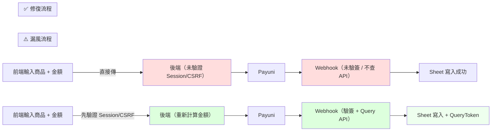

# 設計理念：為什麼這樣做

> 金流開發的四大挑戰 × 四個通用設計原則

---

## 🧭 本章定位：Stage 1 / Understand Why

- **你現在的位置**：剛完成 Stage 0（總覽），準備由「知道有這套教材」→「理解為什麼這樣設計」。
- **本章目標**：把「金流為例的真實痛點」轉換成 4 個可遷移的設計原則，建立全隊共用的語言。
- **輸出物**：一份你能跟夥伴或 AI 溝通的「挑戰 × 原則」對照表，作為後續章節的前置知識。

### 閱讀前先確認
- 你已掃過 `index.md`，知道整體有哪些模組。
- 你對「金流」的細節可以不熟，但願意把它當成練習場。
- 你想要的不只是「怎麼串 API」，而是「為什麼這樣設計」。

### 讀完你能交付
- 用一段話說明「我們是在解決哪 4 個核心挑戰」。
- 將每個挑戰對應到至少一個通用原則，並舉出非金流的應用例子。
- 帶著「這個挑戰保護誰？」的問題進入 Stage 2（系統架構）。

### 推薦搭配閱讀方式
1. 先快速通讀四個挑戰，標記最有感的那一個。
2. 回到同一段，再看「原則」如何緩解痛點。
3. 最後整理一張你自己的「挑戰 → 原則 → 我專案的對應點」速記表。

**預期耗時：** 10 分鐘  
**最好搭配：** 筆記紙或白板，邊讀邊對照自己的專案。

---

## 🎯 四大挑戰與通用原則

### 挑戰 1：「我怎麼確保顧客的資料安全？」

當顧客在你的網站上支付時，他們信任你會妥善保護他們的資訊。但現實是：

- **信用卡資訊可能被竊取**：如果你的伺服器被駭客入侵，會損失多少？
- **API Key 洩露的代價很大**：如果金流 API 金鑰被公開，駭客能直接操作你的帳戶。
- **偽造的請求可能騙過你**：如何確認一個 Webhook 真的來自 Payuni，而不是駭客偽造的？
- **內部人員可能無意中洩露機密**：誰有權存取敏感資訊？什麼時候才該給？

#### 解決原則：多層驗證與安全優先思維

我們在設計時採取了「防禦深度」的策略：
- **永遠不經手信用卡**：委託給 Payuni
- **所有敏感操作都加密傳輸**：AES-256-GCM
- **每個請求都驗證**：Session、CSRF Token、Webhook 簽名
- **敏感資訊隔離管理**：`.env` 與程式碼分離

#### 這個原則能應用在：
- **會員系統**：登入 + 權限驗證 + 操作日誌
- **內容管理系統**：誰能編輯、誰能發佈、誰能刪除
- **醫療系統**：患者資料的存取控制
- **財務管理**：多重簽核、審計追蹤

---

### 挑戰 2：「系統怎樣設計才不會變成一團亂？」

隨著功能增加，程式碼變得複雜：

- **前端、後端、支付系統都要互動**：如果改動一個地方，其他地方會不會壞？
- **一個元件出問題，其他元件要不要跟著受影響？**
- **如何確保每個部分都能被獨立測試和理解？**
- **未來要改用不同的支付服務，要改多少程式碼？**

#### 解決原則：關注點分離（Separation of Concerns）

我們把系統拆成獨立的角色，每個只做自己該做的事：
- **前端**：只負責 UI 和使用者互動
- **後端**：只處理業務邏輯和驗證
- **Payuni**：只負責支付流程
- **Google Sheets**：只儲存訂單資料

每一層相對獨立，這樣當需求變化時，改動範圍更小、風險更低。

#### 這個原則能應用在：
- **微服務架構**：各服務各司其職
- **前後端分離**：前端改版不影響後端
- **外包合作**：清楚的邊界讓團隊協作更順
- **第三方整合**：限定每個整合點的責任

---

### 挑戰 3：「支付成功了，我怎麼才能確定？」

最複雜的一個問題：

- **使用者點完按鈕後，可能網路中斷**：我還是收到錢嗎？
- **Payuni 可能成功處理，但通知卻遲到**：要不要重複計費？
- **我需要根據支付結果觸發後續動作**（寫入資料庫、發送確認信）：但要怎麼確保「支付成功」和「資料記錄」保持一致？

#### 解決原則：非同步通訊與最終一致性

我們設計了兩條平行的通知路線：
- **即時回饋 (Return URL)**：告訴使用者「看起來成功了」
- **可信通知 (Webhook)**：後端驗證「確實成功了」，然後才更新資料庫

這樣即使其中一條路出問題，另一條路仍能確保系統的一致性。

#### 這個原則能應用在：
- **電子郵件系統**：發出郵件的請求和「確實寄出」的確認要分開
- **圖片上傳**：使用者上傳後，背景才開始處理和最佳化
- **訂單系統**：付款、庫存、發貨等各環節要各自確認
- **任務隊列**：非同步工作避免阻塞主流程

---

### 挑戰 4：「我怎麼知道系統哪裡出問題了？」

當某個顧客說「我付了錢但沒收到商品」，你要怎麼查？

- **訂單在哪個環節卡住了？**
- **是前端沒送出請求，還是後端沒收到，還是 Webhook 沒送通知？**
- **半年前的某筆交易出問題，要怎麼查？**

#### 解決原則：可觀測性（Observability）

我們在設計時確保：
- **每個請求都有唯一的追蹤 ID**
- **每個重要操作都有日誌記錄**
- **文件清楚說明各流程的預期行為**

這樣當問題發生時，你能從日誌追蹤整個交易的生命週期。

#### 這個原則能應用在：
- **生產環境故障排查**
- **效能瓶頸診斷**
- **安全事件調查**
- **客戶支援**：快速定位問題根源

---

## 📊 通用設計原則小結

讀到這裡，你會發現金流案例只是載體，真正有價值的是這些原則：

| 挑戰來源 | 設計原則 | 可應用場景 |
|---------|--------|---------|
| 安全疑慮 | **多層驗證、安全優先** | 任何涉及敏感資訊的系統 |
| 複雜度高 | **關注點分離** | 任何需要長期維護的系統 |
| 可靠性低 | **非同步設計、最終一致性** | 任何涉及外部依賴的系統 |
| 難以除錯 | **可觀測性、清晰文件** | 任何需要快速定位問題的系統 |

**核心洞察：** 這套教學包最核心的目標不是「教你怎麼串 Payuni API」，而是讓你學會「面對複雜系統時應該怎麼思考」。金流只是一個最好的練習場。

---

## 🔍 本課程如何實踐這些原則

### 原則在程式碼中的體現

我們會用大量的**自我檢核問題**和**設計啟示**，幫你看見：
- 每行程式碼背後的思考
- 設計決策的取捨（為什麼選 A 而不選 B）
- 如何把這套思維帶到下一個專案

### 豐富的文件與註解

文件本身就是教學工具，我們：
- 不只寫「怎麼做」，也寫「為什麼要這樣做」
- 在程式碼裡加大量註解，解釋設計考量
- 用情境提要、流程圖、表格多角度解釋

### 由淺入深的學習旅程

- 先看「快速成功」（親眼看到成果，建立信心）
- 再看「系統架構」（理解各部分怎麼運作）
- 最後看「深度安全」（掌握細節與取捨）

---

## ⚡ 快速開始：把理念化成行動

### Step 1：定位你的學習目標（5 分鐘）

問自己：
- 我為什麼學這個？（是想快速賺錢、還是想提升能力、還是兩者都要？）
- 我最關心的挑戰是什麼？（安全、架構、可靠性、還是維護性？）

### Step 2：親眼看看系統架構（5 分鐘）

打開 `index.js` 和 `docs/` 資料夾，掃一眼：
- 程式碼有多長？（預期：< 200 行核心邏輯）
- 文件有哪些主題？（預期：從原則到細節都有）

### Step 3：帶著問題進入下一章（5 分鐘）

當你讀 `系統架構` 時，心裡帶著這些問題：

1. **這個流程的每一步在保護誰？**（使用者、系統、或第三方）
2. **如果我要改用不同的支付服務，哪些地方要改？**
3. **當某筆交易出問題，我要怎麼查？**

---

## 📌 下一步

你現在對「為什麼」有了清楚的認識。  
下一步，讓我們看看「怎麼做」。

👉 **[前往系統架構](/02_system-architecture)**

---

## 🚨 漏風流程 vs 🔐 修復流程（Stage 1 → Stage 2 的橋接）

### 漏風流程（新手容易做的做法）
```text
1. 前端直接用 `price` 傳金額給後端                    ← 沒驗證商品資料
2. 後端只看前端帶的 `status`                        ← 跳過 Session/CSRF
3. 回傳 Payuni 資料、用戶跳轉支付                   ← 直接相信前端的額度
4. Webhook 收到後只寫資料庫，不驗簽、也不查 API  ← Webhook 可偽造
5. Google Sheet 直接顯示「成功」，沒雙重驗證           ← 業務只看到成功訊息
```

**結論：** 這流程把驗證都丟給前端、Webhook 沒簽章、後端沒再次查詢，讓任意人只要模擬一個請求就能偽造訂單、改價或重複扣款。

### 修復流程（Stage 2/3 導出的安全架構）
- 後端從 `products.js` 查資料、重新計算金額 → 不信任前端參數。
- 務必驗證 Session + CSRF，再執行 `create-order`。
- Payuni Webhook 收到後先驗簽，再用 Query API 核實金額。
- 僅在驗證 OK 後寫 Google Sheet，並記錄 QueryToken 供追蹤。
- 每個步驟記錄日誌與追蹤 ID，確保問題可追查。

### 流程圖：漏風 vs 修復


**Stage 1 問題提醒：** 如果你在這裡只看到「資料流動到哪」，Stage 2/3 就要補上「誰在驗證」、「需要對應哪一層防線」。這張對照是從挑戰到架構再到安全的橋梁，過去這套流程的人不知道為什麼 Stage 3 那些防線不可省略。

*定位補述：這份教材的定位已依據 Pivoted_Payment_Gateway_Strategy 調整。我們不是在賣「金流串接工具」，而是在教「如何設計複雜系統的思維」。金流只是載體，讓你在真實場景中練習這些原則。*
