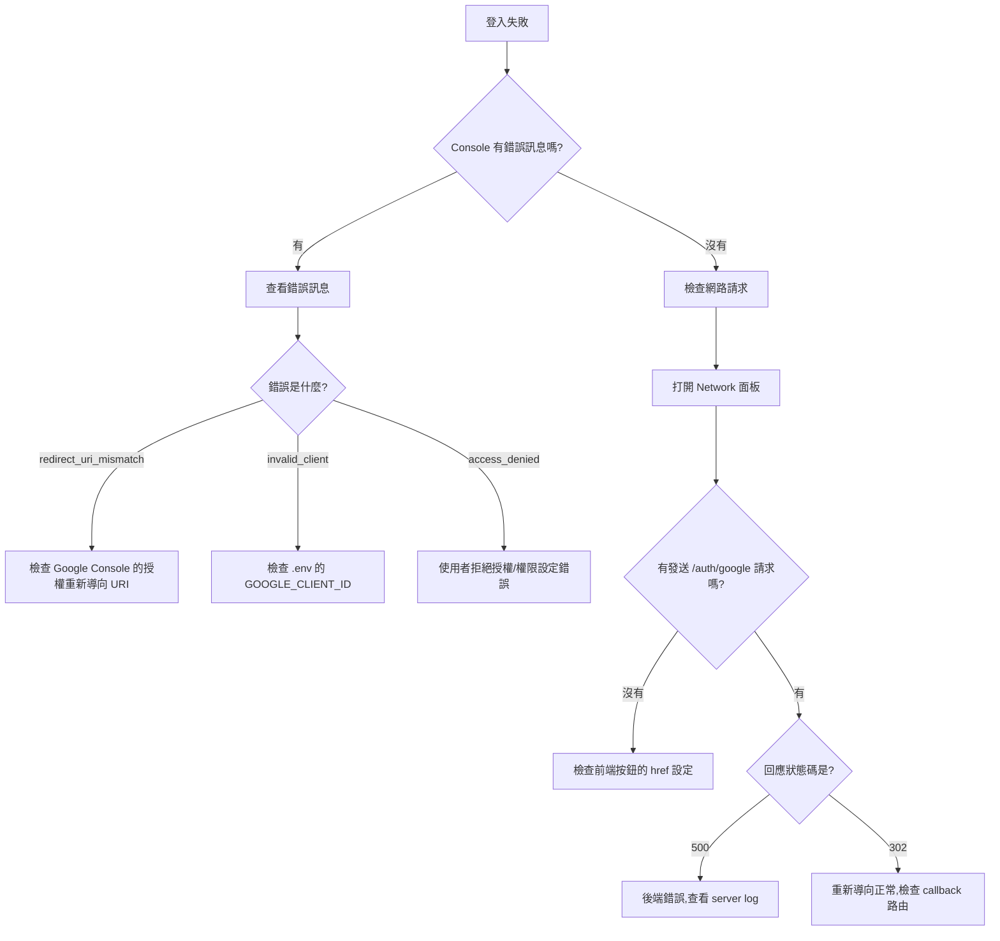
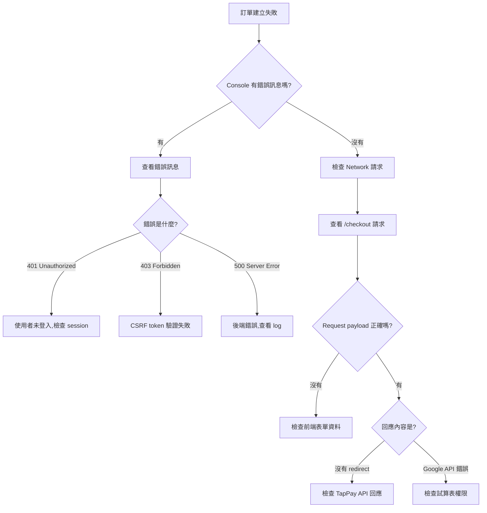
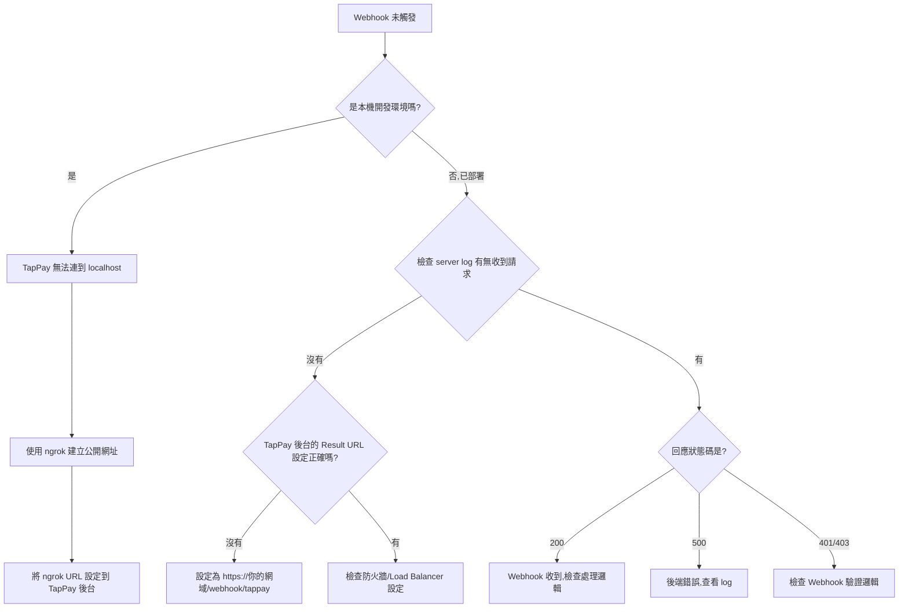
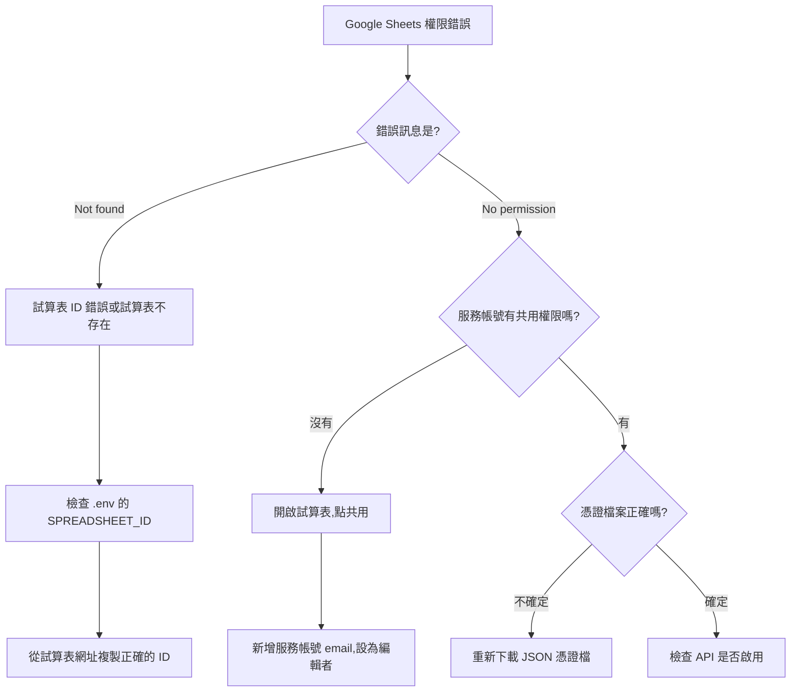

# 疑難排解指南（Troubleshooting Guide）

> **這份文件的目的**：當你遇到問題時,不用慌張或卡關太久。這裡提供系統化的診斷流程、常見問題的解法,以及如何有效尋求幫助。

---

## 🎯 使用這份指南的方法

### 故障診斷的黃金原則

1. **不要猜測,要驗證**
   - ❌ 「應該是 API Key 錯了吧?」
   - ✅ 「我先用 console.log 確認 API Key 有沒有讀到」

2. **逐層檢查,不要跳步驟**
   - 前端 → 後端 → 資料庫 → 第三方 API
   - 確認每一層都正常,再往下一層查

3. **善用日誌與錯誤訊息**
   - 完整的錯誤訊息通常會告訴你問題在哪
   - 學會看 stack trace 的前 3 行

4. **建立「最小可復現案例」**
   - 如果要問人,先把問題簡化到最小範圍
   - 這個過程你自己可能就找到答案了

---

## ⚡ 快速檢查表（5 分鐘版）

| 症狀 | 立刻檢查 | 工具 / 檔案 | 深入解析 |
|------|-----------|--------------|-----------|
| Google 登入失敗 | Browser Console 是否報錯、`.env` 是否載入 | DevTools → Console / Network | [登入失敗](#troubles-login) |
| 訂單按了沒反應 / 沒寫入 | 使用者是否登入、CSRF token 是否帶上 | DevTools → Network、`03_CUSTOMIZATION_GUIDE.md` 表單段落 | [訂單建立失敗](#troubles-checkout) |
| Webhook 沒打進來 | 是否在本機、Result URL 是否設定正確 | `ngrok`, TapPay 後台 | [Webhook 未收到](#troubles-webhook) |
| Google Sheets 權限錯誤 | 服務帳號是否有編輯權、ID 是否正確 | Google Sheets 分享面板 | [試算表權限](#troubles-sheets) |
| 本機 OK、部署掛掉 | HTTPS / Session 設定、環境變數 | 部署平台 Logs | [部署後無法運作](#troubles-deploy) |

> 快速檢查表走完仍未解決，再往下閱讀「深入解析」。

---

## 🔍 深入解析

<a id="troubles-login"></a>
### 🔐 問題 1：登入失敗

### 症狀

- 點擊「Google 登入」後沒反應
- 跳轉到 Google 後無法回到我的網站
- 顯示「無效的 OAuth 憑證」

### 診斷流程圖



### 常見原因與解法

#### ❌ 原因 1：Redirect URI 不匹配

**錯誤訊息**：`redirect_uri_mismatch`

**原因**：Google Console 的「授權重新導向 URI」與你的 callback 路由不一致

**解法**：
1. 打開 [Google Cloud Console](https://console.cloud.google.com/)
2. 憑證 → 選擇你的 OAuth 2.0 用戶端 ID
3. 「已授權的重新導向 URI」必須是：
   ```
   http://localhost:3000/auth/google/callback  (本機測試)
   https://你的網域.com/auth/google/callback   (正式環境)
   ```
4. **注意**：`http` vs. `https`、有沒有結尾斜線、port 號是否正確

---

#### ❌ 原因 2：環境變數未正確載入

**錯誤訊息**：`GOOGLE_CLIENT_ID is undefined`

**原因**：`.env` 檔案沒有被正確讀取

**解法**：
1. 確認 `.env` 檔案在專案根目錄（與 `package.json` 同一層）
2. 確認 `startup.js` 有正確引入 `dotenv`：
   ```javascript
   require('dotenv').config();
   console.log('GOOGLE_CLIENT_ID:', process.env.GOOGLE_CLIENT_ID); // 測試用
   ```
3. 重新啟動 server（改 `.env` 後必須重啟）
4. **常見錯誤**：環境變數名稱打錯、有多餘空格、用引號包住值

---

#### ❌ 原因 3：Session 設定問題

**症狀**：登入後馬上又跳回登入畫面

**原因**：Session 沒有正確存儲或讀取

**解法**：
1. 檢查 `startup.js` 的 session middleware 是否在 Passport 之前：
   ```javascript
   app.use(session({...}));  // 必須先設定 session
   app.use(passport.initialize());
   app.use(passport.session());
   ```
2. 檢查 session secret 是否有設定：
   ```javascript
   secret: process.env.SESSION_SECRET || 'fallback-secret'
   ```
3. 清除瀏覽器 Cookie 後重試

---

#### ❌ 原因 4：Passport 序列化錯誤

**錯誤訊息**：`Failed to serialize user into session`

**原因**：`serializeUser` 或 `deserializeUser` 的邏輯有問題

**解法**：
1. 確認 `serializeUser` 有正確回傳 user ID：
   ```javascript
   passport.serializeUser((user, done) => {
     console.log('Serializing user:', user.id); // 加 log 確認
     done(null, user.id);
   });
   ```
2. 確認 `deserializeUser` 能找到對應的使用者：
   ```javascript
   passport.deserializeUser(async (id, done) => {
     // 檢查資料庫是否有這個 user
   });
   ```

---

<a id="troubles-checkout"></a>
### 💳 問題 2：訂單建立失敗

### 症狀

- 按下「付款」後沒有跳轉到金流頁面
- 顯示「建立訂單失敗」
- Google Sheets 沒有新增一筆訂單

### 診斷流程



### 常見原因與解法

#### ❌ 原因 1：CSRF Token 驗證失敗

**錯誤訊息**：`Invalid CSRF token` 或 `403 Forbidden`

**原因**：前端沒有正確帶 CSRF token

**解法**：
1. 確認前端表單有包含 CSRF token：
   ```html
   <input type="hidden" name="_csrf" value="<%= csrfToken %>">
   ```
2. 如果是 AJAX 請求,要放在 header：
   ```javascript
   fetch('/checkout', {
     headers: {
       'CSRF-Token': csrfToken  // 從 cookie 或 meta tag 取得
     }
   })
   ```
3. 檢查 `csurf` middleware 是否有正確設定

---

#### ❌ 原因 2：Google Sheets API 權限不足

**錯誤訊息**：`The caller does not have permission`

**原因**：服務帳號沒有試算表的編輯權限

**解法**：
1. 打開你的 Google Sheet
2. 點擊「共用」按鈕
3. 新增服務帳號的 email（在 JSON 憑證檔案中的 `client_email`）
4. 權限設為「編輯者」
5. **注意**：如果試算表在 Google Drive 的資料夾中,也要共用資料夾權限

---

#### ❌ 原因 3：TapPay Prime 無效

**錯誤訊息**：`Get prime error` 或 `Invalid prime`

**原因**：前端取得的 Prime 格式錯誤或過期

**解法**：
1. 檢查前端有正確呼叫 `TPDirect.card.getPrime()`：
   ```javascript
   TPDirect.card.getPrime((result) => {
     if (result.status !== 0) {
       console.error('Get prime failed:', result.msg);
       return;
     }
     const prime = result.card.prime;
     // 送到後端
   });
   ```
2. Prime 只能用一次,如果重複提交會失敗
3. 確認 TapPay SDK 的 App ID 和 App Key 正確

---

#### ❌ 原因 4：訂單金額格式錯誤

**錯誤訊息**：`Amount must be an integer`

**原因**：金額是浮點數或字串

**解法**：
```javascript
// ❌ 錯誤
const amount = "1000";  // 字串
const amount = 1000.5;  // 浮點數

// ✅ 正確
const amount = parseInt(productPrice, 10);  // 確保是整數
```

---

<a id="troubles-webhook"></a>
### 🔔 問題 3：Webhook 未收到或資料未更新

### 症狀

- 在 TapPay 測試工具看到「交易成功」
- 但 Google Sheets 的訂單狀態仍是「pending」
- `console.log` 沒有顯示 Webhook 收到資料

### 診斷流程



### 常見原因與解法

#### ❌ 原因 1：本機開發環境無法收 Webhook

**原因**：TapPay 伺服器無法連到你的 `localhost:3000`

**解法**：使用 **ngrok** 建立臨時公開網址

1. 安裝 ngrok：
   ```powershell
   # 下載 ngrok (https://ngrok.com/)
   # 或用 Chocolatey 安裝
   choco install ngrok
   ```

2. 啟動 ngrok：
   ```powershell
   ngrok http 3000
   ```

3. 會得到一個臨時網址,例如：`https://abc123.ngrok.io`

4. 到 TapPay 後台設定 Result URL：
   ```
   https://abc123.ngrok.io/webhook/tappay
   ```

5. **注意**：每次重啟 ngrok 網址會變,要重新設定

---

#### ❌ 原因 2：Webhook URL 設定錯誤

**症狀**：TapPay 說「通知失敗」

**原因**：Result URL 的路徑或網域不對

**解法**：
1. 確認 TapPay 後台的 Result URL 是：
   ```
   https://你的網域.com/webhook/tappay
   ```
2. 確認後端路由有對應：
   ```javascript
   app.post('/webhook/tappay', async (req, res) => {
     // ...
   });
   ```
3. **常見錯誤**：
   - 結尾多了 `/`
   - 用 `http` 而非 `https`（正式環境必須 HTTPS）
   - 路徑大小寫錯誤

---

#### ❌ 原因 3：Webhook 簽名驗證失敗

**錯誤訊息**：`Invalid webhook signature`

**原因**：沒有正確驗證 TapPay 的簽名

**解法**：
1. 確認有從 request header 取得簽名：
   ```javascript
   const receivedSignature = req.headers['x-tappay-signature'];
   ```
2. 使用正確的方式計算簽名：
   ```javascript
   const crypto = require('crypto');
   const calculatedSignature = crypto
     .createHmac('sha256', process.env.TAPPAY_PARTNER_KEY)
     .update(JSON.stringify(req.body))
     .digest('hex');
   ```
3. 比對簽名是否一致：
   ```javascript
   if (receivedSignature !== calculatedSignature) {
     return res.status(403).send('Invalid signature');
   }
   ```

---

#### ❌ 原因 4：資料更新邏輯錯誤

**症狀**：Webhook 有收到,但試算表沒更新

**原因**：更新 Google Sheets 的邏輯有問題

**解法**：
1. 加 log 確認有進入更新邏輯：
   ```javascript
   console.log('Updating order:', orderNumber, 'to status:', status);
   ```
2. 確認有正確找到對應的 row：
   ```javascript
   const rows = await sheet.getRows();
   const targetRow = rows.find(row => row.訂單編號 === orderNumber);
   if (!targetRow) {
     console.error('Order not found:', orderNumber);
     return;
   }
   ```
3. 確認欄位名稱與試算表完全一致（包含大小寫）：
   ```javascript
   targetRow.狀態 = 'success';  // 欄位名稱要完全一樣
   await targetRow.save();
   ```

---

<a id="troubles-sheets"></a>
### 📋 問題 4：Google Sheets 權限問題

### 症狀

- 錯誤訊息：`The caller does not have permission`
- 或：`Requested entity was not found`

### 診斷流程



### 常見原因與解法

#### ❌ 原因 1：服務帳號未獲得權限

**解法**：
1. 打開你的 Google Sheet
2. 點擊右上角「共用」按鈕
3. 在「新增使用者和群組」輸入服務帳號的 email
   - Email 在 `google-credentials.json` 的 `client_email` 欄位
   - 通常長這樣：`your-service@project-id.iam.gserviceaccount.com`
4. 權限選擇「編輯者」
5. 取消勾選「通知使用者」（服務帳號不需要通知）
6. 點擊「共用」

---

#### ❌ 原因 2：試算表 ID 錯誤

**解法**：
1. 打開你的 Google Sheet
2. 從網址列複製 ID：
   ```
   https://docs.google.com/spreadsheets/d/1A2B3C4D5E6F7G8H9I0J/edit
                                        ^^^^^^^^^^^^^^^^^^^^^^
                                        這一段就是 ID
   ```
3. 貼到 `.env`：
   ```
   SPREADSHEET_ID=1A2B3C4D5E6F7G8H9I0J
   ```

---

#### ❌ 原因 3：Google Sheets API 未啟用

**解法**：
1. 到 [Google Cloud Console](https://console.cloud.google.com/)
2. 選擇你的專案
3. 左側選單 → API 和服務 → 資料庫
4. 搜尋「Google Sheets API」
5. 點擊「啟用」

---

<a id="troubles-deploy"></a>
### 🚀 問題 5：部署後無法運作

### 症狀

- 本機測試正常,部署到 Heroku/Render/Vercel 後出錯
- 顯示「Application error」或 500 錯誤
- 環境變數好像沒有生效

### 診斷流程

1. **檢查環境變數是否有設定**
   - Heroku: Settings → Config Vars
   - Render: Environment → Environment Variables
   - Vercel: Settings → Environment Variables

2. **檢查 logs**
   ```powershell
   # Heroku
   heroku logs --tail
   
   # Render
   # 在 Dashboard 點擊 Logs 頁籤
   ```

3. **常見問題**：
   - PORT 環境變數未正確設定
   - HTTPS 相關設定（Session 的 `secure` 要改成 `true`）
   - Callback URL 要改成正式網域
   - 資料庫連線字串錯誤

---

## 🆘 如何有效尋求幫助

### 準備資訊的檢查清單

當你要在社群、論壇、或向我們尋求幫助時,請先準備以下資訊：

#### ✅ 必備資訊

1. **完整的錯誤訊息**
   - 截圖或複製貼上完整的 error message
   - 包含 stack trace 的前 5-10 行

2. **你已經嘗試過的方法**
   - 避免重複建議相同的解法
   - 展現你有先做功課

3. **相關的程式碼片段**
   - 不要貼整個檔案,只貼相關的 20-30 行
   - 標註哪一行出錯

4. **環境資訊**
   - 作業系統（Windows/Mac/Linux）
   - Node.js 版本（`node -v`）
   - 是本機還是部署環境

#### 📋 問題描述模板

```markdown
**問題描述**：
（用一句話總結問題）

**錯誤訊息**：
```
（完整的錯誤訊息）
```

**相關程式碼**：
```javascript
（貼上有問題的程式碼片段）
```

**我已經嘗試過**：
1. ...
2. ...

**環境資訊**：
- OS: Windows 11
- Node.js: v18.15.0
- 部署環境: 本機開發
```

---

## 🧠 除錯思維心法

### 1. 二分搜尋法

當不確定哪裡出問題時,逐步縮小範圍：

```javascript
// 在關鍵節點加 console.log
console.log('1. 進入 checkout 路由');
// ...
console.log('2. 通過 CSRF 驗證');
// ...
console.log('3. 呼叫 TapPay API');
// ...
console.log('4. 寫入 Google Sheets');
```

看到哪一步沒印出來,就知道問題在哪個區間。

---

### 2. 隔離變數法

懷疑某個變數有問題時,單獨測試它：

```javascript
// 懷疑 prime 格式有問題
console.log('Prime type:', typeof prime);
console.log('Prime length:', prime.length);
console.log('Prime value:', prime);
```

---

### 3. 最小可復現案例

如果問題很複雜,試著建立一個最簡化的版本：

```javascript
// 例如:測試 Google Sheets 連線
async function testGoogleSheets() {
  const auth = await getGoogleAuth();
  const sheets = google.sheets({ version: 'v4', auth });
  const response = await sheets.spreadsheets.values.get({
    spreadsheetId: process.env.SPREADSHEET_ID,
    range: 'A1:A1'
  });
  console.log('Success:', response.data);
}

testGoogleSheets().catch(console.error);
```

如果這個測試通過,代表 Google Sheets 連線正常,問題在別的地方。

---

## 📚 延伸閱讀

- **Chrome DevTools 教學**：[官方文件](https://developer.chrome.com/docs/devtools/)
- **Node.js 除錯技巧**：[Debugging Guide](https://nodejs.org/en/docs/guides/debugging-getting-started/)
- **如何提問的智慧**：[經典文章](https://github.com/ryanhanwu/How-To-Ask-Questions-The-Smart-Way)

---

**下一步**：如果還是無法解決,請參考 `sales/08_FAQ_OBJECTIONS.md`,或聯繫我們的技術支援！
