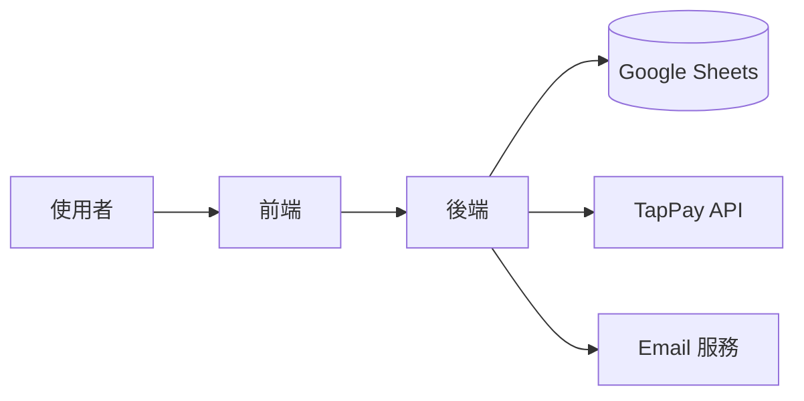

# 畢業專題挑戰（Capstone Project）

> **這份文件的目的**：透過一個完整的挑戰任務，驗證你是否真正掌握了這套教材的核心能力。這不是「交作業」，而是「展示你的架構思維」。

---

## 🎯 什麼是 Capstone Project？

**Capstone Project** 是學習旅程的最後一哩路：
- ✅ 驗證你的學習成果
- ✅ 整合所有知識點
- ✅ 產出一個可放入履歷的作品
- ✅ 獲得我們的認證（如果完成度達標）

**這不是考試，而是一個創作機會。**

---

## 📋 挑戰任務說明

### 任務主題

**「設計一個會員訂閱制系統」**

### 需求描述

你需要在原有的金流系統基礎上，擴充以下功能：

#### 核心需求（必做）

1. **訂閱方案管理**
   - 至少提供 2 種訂閱方案（例如：月繳 $299、年繳 $2,999）
   - 方案資訊存在 Google Sheets 或資料庫中
   - 前端展示方案比較表

2. **自動扣款機制**
   - 使用 TapPay 的定期定額 API（或模擬）
   - 到期前 3 天提醒使用者
   - 扣款成功後更新訂閱狀態

3. **訂閱狀態管理**
   - 使用者可查看目前訂閱方案
   - 可升級、降級、取消訂閱
   - 狀態包含：active、expired、cancelled

4. **安全性考量**
   - 確保只有本人能查看/修改自己的訂閱
   - CSRF 保護
   - 敏感資訊加密

#### 進階需求（選做，加分）

5. **優惠碼系統**
   - 支援折扣碼（例如：WELCOME2024 打 8 折）
   - 驗證碼有效期限
   - 記錄使用紀錄

6. **訂閱分析面板**
   - 顯示總訂閱人數
   - 每月營收統計
   - 流失率計算

7. **Email 通知**
   - 訂閱成功寄信
   - 到期提醒
   - 扣款失敗通知

---

## 🛠️ 技術要求

### 必須使用的技術

- ✅ **後端**：Node.js + Express.js
- ✅ **認證**：Google OAuth 2.0（已有基礎）
- ✅ **金流**：TapPay（或模擬付款）
- ✅ **資料存儲**：Google Sheets 或任何資料庫
- ✅ **安全機制**：Session、CSRF Token、Helmet

### 可自由選擇的技術

- 前端框架（React、Vue、或純 HTML/CSS）
- Email 服務（SendGrid、Mailgun、或本機模擬）
- 排程工具（node-cron、或手動觸發）

---

## 📐 設計要求

### 你必須產出以下文件

#### 1. 系統架構圖

繪製整個系統的架構圖，包含：
- 使用者、前端、後端、資料庫、第三方 API 的關係
- 關鍵資料流向
- 建議工具：draw.io、Excalidraw、Mermaid

**範例格式**（Mermaid）：


#### 2. 資料表設計

定義你的資料結構（不管是用 Sheets 還是 SQL）：

**範例**：
```
訂閱方案表（Subscriptions）
- id（唯一識別）
- user_email（使用者）
- plan_type（方案類型：monthly/yearly）
- status（狀態：active/expired/cancelled）
- start_date（開始日期）
- end_date（到期日期）
- created_at（建立時間）
```

#### 3. API 規劃文件

列出你的 API 端點：

| 方法 | 路徑 | 說明 | 權限 |
|-----|------|------|-----|
| GET | `/subscriptions/plans` | 取得所有方案 | 公開 |
| GET | `/subscriptions/me` | 取得我的訂閱 | 需登入 |
| POST | `/subscriptions/subscribe` | 訂閱方案 | 需登入 |
| PUT | `/subscriptions/cancel` | 取消訂閱 | 需登入 |

#### 4. 設計決策說明

撰寫一份 `DESIGN_DECISIONS.md`，回答以下問題：

**安全性決策**：
- 為什麼選擇這種認證方式？
- 如何防止 CSRF 攻擊？
- 敏感資訊如何處理？

**架構決策**：
- 為什麼選擇這種資料存儲方式？
- 如何處理定期扣款的排程？
- 如何確保訂閱狀態的一致性？

**Trade-offs（取捨）**：
- 你有考慮過哪些替代方案？
- 為什麼最終選擇這個方案？
- 有哪些已知的限制或風險？

---

## 📊 評分標準

### 功能完整度（40 分）

| 項目 | 分數 | 評分標準 |
|-----|------|---------|
| 核心需求 1-2 | 20 | 訂閱方案與扣款機制能運作 |
| 核心需求 3-4 | 20 | 狀態管理與安全性考量完整 |
| 進階需求 | +10 | 每完成一項加分需求 +3-5 分 |

### 架構設計（30 分）

| 項目 | 分數 | 評分標準 |
|-----|------|---------|
| 架構圖清晰 | 10 | 能看懂資料流向，元件職責明確 |
| 資料表設計合理 | 10 | 欄位完整，沒有明顯設計缺陷 |
| API 設計 RESTful | 10 | 符合 REST 原則，命名直覺 |

### 設計思維（20 分）

| 項目 | 分數 | 評分標準 |
|-----|------|---------|
| 設計決策說明 | 10 | 能清楚說明「為什麼這樣設計」 |
| Trade-offs 分析 | 10 | 有考慮替代方案與權衡利弊 |

### 程式品質（10 分）

| 項目 | 分數 | 評分標準 |
|-----|------|---------|
| 程式碼可讀性 | 5 | 命名、縮排、註解清楚 |
| 錯誤處理 | 5 | 有適當的 try-catch 與錯誤訊息 |

### 總分計算

- **80 分以上**：優秀，展現出色的架構思維 🏆
- **70-79 分**：良好，掌握核心概念 ✅
- **60-69 分**：及格，但仍有進步空間 ⚠️
- **60 分以下**：建議重新學習，補強基礎 ❌

---

## 📤 提交方式

### 你需要提交：

1. **GitHub Repository**
   - 包含完整程式碼
   - README.md 說明如何執行
   - DESIGN_DECISIONS.md 設計決策文件

2. **Demo 影片或截圖**
   - 展示核心功能運作
   - 說明你的設計亮點
   - 長度 3-5 分鐘即可

3. **架構圖與文件**
   - 可放在 `docs/` 資料夾
   - 或整合在 README 中

### 提交流程

1. 完成專案後，將 GitHub 連結填入表單：
   - **表單連結**：`https://forms.gle/xxxxx`（調整為你的表單）

2. 我們會在 **7 個工作天內** 審核並回饋

3. 達標者可獲得：
   - ✅ **完成證明**（PDF 證書）
   - ✅ **LinkedIn 技能徽章**（如適用）
   - ✅ **作品集推薦文**（可用於求職）

---

## 💡 開始之前的建議

### 時間規劃

建議分配時間如下：

| 階段 | 時間 | 任務 |
|-----|------|------|
| **規劃階段** | 2-3 小時 | 畫架構圖、設計資料表、規劃 API |
| **開發階段** | 10-15 小時 | 實作核心功能 + 選做功能 |
| **文件撰寫** | 2-3 小時 | 完成設計決策說明 |
| **測試與除錯** | 2-4 小時 | 確保功能正常運作 |
| **錄製 Demo** | 1 小時 | 展示成果 |
| **總計** | **17-26 小時** | 分散在 1-2 週完成 |

### 學習策略

1. **先規劃，再動手**
   - 不要急著寫 code，先把架構想清楚
   - 畫出資料流程圖，確認每一層的職責

2. **逐步實作，不要一次做完**
   - 先完成最小可行版本（MVP）
   - 再逐步加功能

3. **善用 AI 助手**
   - 遇到不確定的地方，問 ChatGPT/Claude
   - 但不要直接複製貼上，要理解邏輯

4. **參考原始專案**
   - 這套教材的原始專案就是很好的範例
   - 看看我們如何處理登入、訂單、Webhook

---

## 🎓 成功案例參考

### 案例 1：王同學的「健身房會員系統」

**亮點**：
- 使用 node-cron 每天檢查到期會員
- 設計了會員等級系統（Bronze/Silver/Gold）
- 優惠碼系統支援「首購限定」邏輯

**設計決策摘錄**：
> 「我選擇用 Google Sheets 而非資料庫，因為這個專案規模小，且老闆希望能直接在試算表看數據。但我設計了完整的 CRUD API，未來要遷移到 PostgreSQL 也很容易。」

### 案例 2：李同學的「線上課程訂閱」

**亮點**：
- 整合 SendGrid 自動寄送 Email
- 使用 Chart.js 做訂閱分析面板
- 支援「暫停訂閱」功能（不是取消，而是凍結）

**設計決策摘錄**：
> 「我考慮過用 JWT，但最終選擇 Session，因為訂閱系統需要能『即時撤銷』使用者的權限（例如付款失敗）。如果用 JWT，token 過期前無法撤銷。」

---

## ❓ 常見問題

### Q1：我可以改用其他金流平台嗎？

✅ **可以**。如果你更熟悉 ECPay、綠界、Stripe，可以自由替換。
- 重點是展現「整合第三方 API」的能力
- 記得在 DESIGN_DECISIONS.md 說明為何選擇這個平台

### Q2：我可以用資料庫取代 Google Sheets 嗎？

✅ **當然可以**。用 MongoDB、PostgreSQL、MySQL 都行。
- 這甚至是加分項，展現你會資料庫設計
- 記得說明為何選擇這種資料庫

### Q3：一定要完成所有進階需求嗎？

❌ **不用**。進階需求是加分項，不做也能及格。
- 核心需求達標 + 設計文件完整 = 就能拿到 70 分
- 進階需求每完成一項，額外加 3-5 分

### Q4：可以參考別人的專案嗎？

✅ **可以參考，但不能抄襲**。
- 參考是：看別人的架構設計，理解後用自己的方式實作
- 抄襲是：直接複製貼上程式碼，改個變數名稱

**我們會檢查程式碼，抄襲會直接不通過。**

### Q5：提交後多久會收到回饋？

⏱️ **7 個工作天內**。
- 我們會仔細審核你的程式碼、文件、設計決策
- 提供詳細的改進建議（不管有沒有及格）

### Q6：沒通過可以重交嗎？

✅ **可以**。我們會告訴你哪裡需要改進。
- 修改後重新提交即可
- 沒有重交次數限制

---

## 🚀 準備好接受挑戰了嗎？

這個 Capstone Project 是你展現架構思維的舞台：
- 不只是「能動」，而是「設計完整」
- 不只是「交作業」,而是「產出作品」
- 不只是「學完了」,而是「真的會了」

**記住**：
> 「好的架構不是一次寫對，而是持續迭代。」
> 
> 不要害怕犯錯，重點是展現你的思考過程。

---

## 📚 延伸資源

在開始專案前，建議複習以下文件：

- `00_DESIGN_PHILOSOPHY.md`：回顧設計理念
- `01_SYSTEM_ARCHITECTURE.md`：參考架構設計
- `02_SECURITY_DEEP_DIVE.md`：確保安全性考量
- `03_CUSTOMIZATION_GUIDE.md`：實作技巧參考
- `07_TROUBLESHOOTING.md`：遇到問題時的除錯指南

---

**準備好了就開始吧！我們期待看到你的作品！** 🎉

**有任何問題**，隨時回來查看 `sales/08_FAQ_OBJECTIONS.md` 或聯繫我們。

**Good luck & Have fun!** 💪
